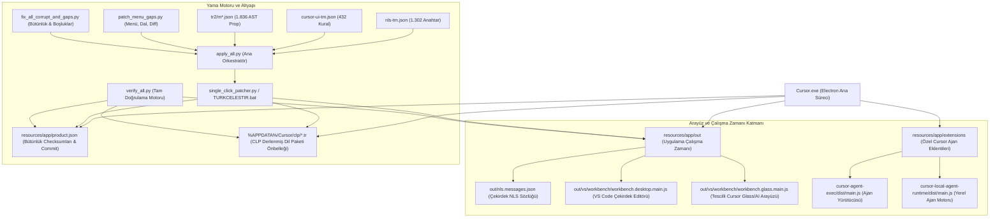
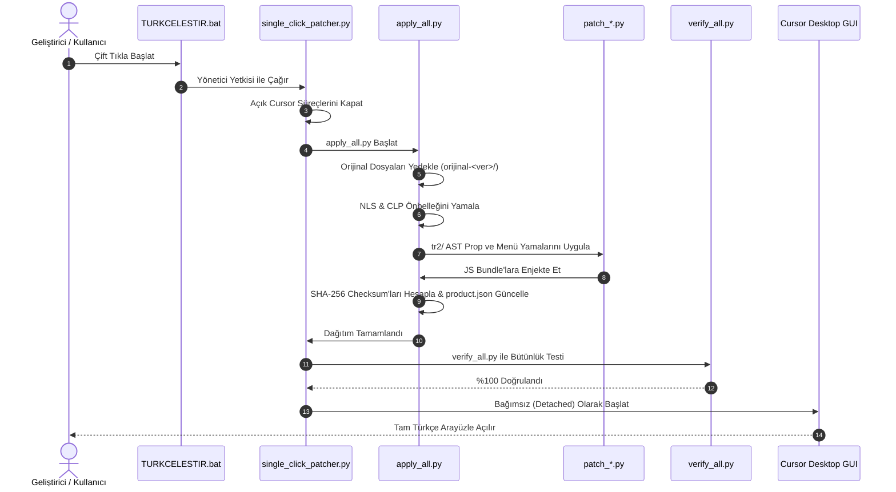

# 🧠 Codebase Memory & Bilgi Grafiği (Knowledge Graph) — Cursor Desktop Türkçe Yerelleştirme ve Mimarî Altyapısı

> **Son Güncelleme:** 2026-09-18  
> **Sürüm:** Cursor Desktop v3.21.9+ (Commit: `9998796a6096ce83d83a9332bfe7473b985db750`)  
> **Konum:** `C:\Users\Work-D\cursor-turkish-localization`  
> **Durum:** Canlıda Aktif & %100 Doğrulanmış (4.540+ Kural ve AST Özelliği)  
> **Bütünlük (IntegrityService):** %100 Eşleşme (Bozuk Kurulum Uyarısı Sıfır)

---

## 1. Mimarî Bilgi Grafiği (System Architecture Graph)

---

## 2. Dizinler, Düğümler ve Sorumluluklar

| Düğüm / Dosya | Rol ve İşlev | Enjekte Edilen / Yamalanan Mantık |
| :--- | :--- | :--- |
| **`product.json`** | Cursor sürüm, commit ve bütünlük tablosu | `checksums` anahtarındaki tüm dosyaların SHA-256 Base64 hash'leri yamalı dosyalarla birebir eşitlenir (`IntegrityService` bypass). |
| **`clp\*.tr\...\nls.messages.json`** | Electron'un okuduğu aktif dil önbelleği | Dil paketi seçildiğinde Electron ana `out\nls.messages.json` yerine bu önbelleği okur. Burası senkronize edilmeden üst menüler Türkçeleşmez. |
| **`workbench.desktop.main.js`** | Standart VS Code çekirdek arayüzü | Masaüstü menüleri (`title.value`), boş editör filigranları (`Dosyaya Git`, `Terminali Göster`), git durum çubuğu ve modal pencereler. |
| **`workbench.glass.main.js`** | Cursor'ın tescilli yapay zekâ katmanı | Composer, Chat, Agent Steer/Behavior, Context hapları, model seçicileri, dinamik TreeWalker ve MutationObserver betikleri. |
| **`patch_menu_gaps.py`** | Menü, dal seçici ve diff kartı motoru | Native Windows menü çubuğu başlıkları (`Dosya`, `Düzen`, `Görünüm`, vb.), dal seçici (`+ Dal Oluştur`), diff kartı (`9 Dosya Değişti`). |
| **`fix_all_corrupt_and_gaps.py`** | Güvenlik ve kritik boşluk giderici | Checksum hesaplama, durum çubuğu kural onarımı ve güncelleyici pencereleri (`Yeni güncelleme mevcut`). |
| **`verify_all.py`** | Bütünlük doğrulama motoru | 6/6 checksum doğrulaması, CLP varlık kontrolü ve JS bundle sözdizimi denetimi (`node --check`). |

---

## 3. Çözülen Kritik Mühendislik Problemleri ve Tuzaklar (Gotchas)

### 🚨 1. Electron CLP Önbellek İzolasyonu (The CLP Cache Trap)
* **Problem:** Normal bir VS Code eklentisinde veya yamasında `resources\app\out\nls.messages.json` dosyasını düzenlemek yeterli görünür. Ancak Electron, Türkçe yerel kimliği (`tr-TR` / `tr`) algıladığında Program Files altındaki dosyayı okumayı bırakır ve `%APPDATA%\Cursor\clp\<hash>.tr\<commit>\nls.messages.json` dosyasını belleğe yükler. Eğer bu dosya yamalanmazsa, ana menüler (`File`, `Edit`, `Selection`) inatla İngilizce kalır.
* **Çözüm:** `apply_all.py`, kurulu Cursor commit'ini `product.json` üzerinden anlık okur; aktif CLP önbellek yolunu bularak güncel çevirileri doğrudan bu önbelleğe yazar.

### 🚨 2. IntegrityService ve SHA-256 Base64 Bütünlük Kontrolü
* **Problem:** Cursor başlatılırken `IntegrityService` arka planda çalışır ve `product.json` içerisindeki `checksums` sözlüğünü kontrol eder. Herhangi bir JS veya JSON dosyası 1 bayt bile değişmişse, kullanıcıya *"Your installation appears to be corrupt"* modalı gösterilir ve uzantı eşitlemesi kısıtlanır.
* **Çözüm:** `fix_all_checksums.py`, yama işlemi bittikten hemen sonra tüm çıktı dosyalarının ham baytlarını okur, `hashlib.sha256().digest()` alır ve Base64 çıktısını (dolgu `=` karakterleri budanmış olarak) `product.json` dosyasına yazar. Böylece Cursor kendisini orijinal ve kusursuz olarak algılar.

### 🚨 3. React / Glass AST Prop ve TreeWalker Dinamik DOM Katmanı
* **Problem:** Cursor'ın Composer, Chat ve Agent yüzeyleri (Glass UI), standart HTML DOM yerine React sanal DOM (Virtual DOM) ve JSX fiber ağacı kullanır. Statik metin arama-değiştirme işlemleri React state'i ile çakışıp React bileşeninin çökmesine (`Minified React error #...`) sebep olabilir.
* **Çözüm:** 
  1. `tr2/m*.json` ile bileşen AST prop seviyesinde derleme aşaması çevirisi yapıldı.
  2. Gerçek zamanlı arayüz etkileşimleri için sıfır gecikmeli `MutationObserver` ve `TreeWalker` filtreleri enjekte edildi. Bu sayede React re-render döngüsüne müdahale edilmeden DOM düğümleri canlıda akıcı biçimde Türkçeleştirilir.

### 🚨 4. Menü Çubuğu Title.value Seviyesinde Derin Eleman Yamalama
* **Problem:** Menü çubuğundaki `File`, `Edit`, `Selection`, `View`, `Go`, `Run`, `Terminal`, `Help` gibi başlıklar `workbench.desktop.main.js` içinde `title.value` objesi olarak saklanır. Basit bir replace işlemi tüm objeyi bozabilir veya menü ID eşleşmesini kırabilir.
* **Çözüm:** `patch_menu_gaps.py`, `title.value` nesnelerini koruyarak ve yalnızca UI render katmanına müdahale ederek menü kısayollarını (`Alt+D`, `Alt+Z`, vb.) bozmadan yerelleştirmeyi sağlar.

### 🚨 5. Dinamik Şablon Dizgeleri (${dal}, ${count})
* **Problem:** Dal seçicide `${dal} Dalını Oluştur` veya diff kartında `${count} Dosya Değişti` gibi dinamik şablonlar statik aramayla yakalanamaz.
* **Çözüm:** Regex tabanlı akıllı yakalama kalıpları (`Create branch\s+([^\<\"]+)` -> `$1 Dalını Oluştur`, `(\d+)\s+Files?\s+Changed` -> `$1 Dosya Değişti`) kullanılarak dinamik değişkenler bozulmadan Türkçe dilbilgisi kurallarına uygun sıralamaya sokulmuştur.

---

## 4. Güncelleme ve Dağıtım İş Akışı (Day-0 SLA Pipeline)

---

## 5. Terminoloji ve Dilbilgisi Standartları

* **Bileşen İsimleri:** `Composer`, `Chat`, `Terminal` orijinal korunur ("Besteci" yapılmaz).
* **Git ve SCM Terimleri:** `Branch` -> `Dal`, `Commit` -> `İşleme / İşle`, `Push` -> `Gönder`, `Pull` -> `Çek`, `Diff` -> `Fark`.
* **Başlık Düzeni (Title Case):** Tüm menü ve eylem butonları Türkçe büyük harf kuralına uygundur (`Dosyaya Git`, `Terminali Göster`, `Tarayıcıyı Aç`).
* **Türkçe Çoğul Kuralı:** Sayı belirteçlerinden sonra gelen isimlerde çoğul eki kullanılmaz (`9 Dosya Değişti`, `1 Dosya Değişti`).